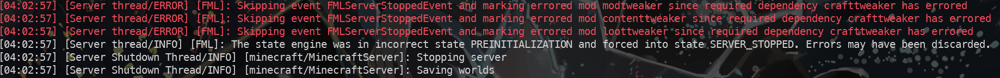

這篇是專門對於 RLCraft Server 而寫的 Writeup，但如果不是 RLCraft，而是其他 FTB 之類或是自己包的模組伺服器，可以自行將 RLCraft 解說的共同部分如 `Forge`, `Java`, `Chunk Pregenerator(非必要)`，甚至是 `Server 端要放入的 Mods`，做完再進入 Server 和 Client 篇。

## Tech Stack
1. Remote Server skill
2. Linux command
3. Script (fundamental)
4. Minecraft Server pack install
5. DNS and CF tunnel

## 官方備註事項

1. 檢視距離應設為10以確保完整相容性，但如果有許多玩家導致性能問題，可將其降至8或甚至6，但不應低於此數值。
> view-distance should be 10 for full compatibility, but if you get performance issues with many players, lower this to 8 or even 6, but shouldn't go below that
2. 請注意，JEI 將會不正確地顯示附魔應用，但附魔仍然會正常運作，並且僅應用於它們實際允許的物品，儘管JEI顯示的內容。除了重新開始一個新的世界外，沒有其他解決方案。
> Note that JEI will incorrectly show enchantment applications, but enchantments will still work fine and only apply to things they're actually allowed to, despite whatever JEI shows.  There is no fix for this except starting a new world.
3. 自動重新啟動功能是有幫助的，但 RLCraft v2.9+ 在緩存和垃圾回收 (`garbage collection`) 方面比 2.8.2 要好得多，不再需要頻繁重新啟動或強制重新啟動。
> Automatic restarts can be helpful, though RLCraft v2.9+ is MUCH better about cache and garbage collection than 2.8.2 was, and frequent restarts are no longer needed or required
4. 對於有大量玩家並且運行時間長（幾個月甚至更長）的大型伺服器，建議偶爾刪除世界資料夾中的 `Village.dat` 檔案，因為該檔案可能會變得過大並開始記憶體洩漏，導致大型卡頓和逾時。對於大多數人來說，這可能不是問題。
> It is recommended to occasionally delete the Village.dat file in your world folder for very large servers with tons of players that have been running a long time (several months if not longer) as this file can get too big and begin to memory leak, causing big lag spikes and timeouts.  This likely won't be an issue for the majority of people.


## Get Server Pack of RLCraft 2.9.3
https://www.curseforge.com/minecraft/modpacks/rlcraft/screenshots

## Install Forge
先建立一個 folder `RLCraft`
* `mkdir RLCraft`
* `cd RLCraft/`

1. [Download Forge Latest 1.12.2 - 14.23.5.2860](https://files.minecraftforge.net/net/minecraftforge/forge/index_1.12.2.html)
2. `java -jar ./forge-1.12.2-14.23.5.2860-installer.jar --installServer`
3. `java -Xms4G -Xmx8G -jar ./forge-1.12.2-14.23.5.2860.jar`
4. 將 `eula.txt` 中的 false 改為 true
5. 重新執行第三步
6. 結束 (如果有要做 pregen 或是將指令包成 `xxx.sh` 請繼續往下看)
7. Minecraft 第一次生成後(preparing area 完成後)，`> stop`
8. `rm -r world/`
9. 見下方 Chunk Pregenerator

### Chunk Pregenerator & 包成執行檔
1. `sudo wget https://media.forgecdn.net/files/2811/832/Chunk+Pregenerator+V1.12-2.2.jar`
2. `echo cd ~/RLCraft > rlcraft.sh`
3. `echo java -Xms4G -Xmx8G -jar forge-1.12.2-14.23.5.2860-installer.jar >> rlcraft.sh`
4. `chmod +x rlcraft.sh`
5. `./rlcraft.sh`
6. `> /pregen utils setPriority pregenerator`
7. `> /pregen timepertick 250`
8. `> /pregen gen startmassradius square 0 0 b10000 100`


## Error Handling
1. A problem occurred running the Server launcher.java.lang.reflect.InvocationTargetException
    * 因為 1.12.2 只支援 java 8
    * 因此 
        1. `sudo apt-get purge openjdk*`
        2. `sudo apt install openjdk-8-jre`
2. 
    * 權限不夠。`sudo`


## Server 端指令

### Remote Server Info

1. Ubuntu 20.04.6 LTS x86_64
2. Memory: 8 GB

### Use Screen

我使用 screen，而非 tmux，原因傾向 screen 已經符合我的需求，因此我這裡只記錄 screen 的功能。

### Screen open
```sh
$ screen -S <name>
```
### Screen detached
```
Ctrl A + D
```

### Start Cloudflared

1. 我是先有自己的 domain
2. Create Tunnels -> https://blog.samsam123.name.my/articles/cf-tunnel-minecraft-expose-public
    * `$ cloudflared tunnel create ${TUNNEL名稱}`
3. 再來進入 Cloudflare > Zero Trust > Network > Tunnels 確認是否建立
4. 
```sh
$ cloudflared tunnel route dns ${TUNNEL名稱} ${域名名稱-子域名}
$ cloudflared tunnel --name ${TUNNEL名稱} --url tcp://127.0.0.1:25565
```

### 初次建立後未來使用
1. 進 remote server
2. 查看 screen name 是否存在，不存在就 Screen open `$ screen -S <name>`
3. 
```sh
$ cloudflared tunnel route dns ${TUNNEL名稱} ${域名名稱-子域名}
$ cloudflared tunnel --name ${TUNNEL名稱} --url tcp://127.0.0.1:25565
```
4. Screen detached

## 客戶端 (Client) 指令與連接 Server 方法

* 如果開完 Server，當然要有 Client 才算完整

### 裝 Cloudflare

* Windows
    * `winget install --id Cloudflare.cloudflared`
* Linux
    * See offical download method: https://developers.cloudflare.com/cloudflare-one/connections/connect-networks/downloads/

### 啟動腳本

我朋友和我是使用 Windows 遊玩，因此我把啟動 cloudflared 的方法包成 `.bat`，他們和我要玩時「開啟 `.bat`」，然後記得 **「啟動後不要關閉」、「啟動後不要關閉」、「啟動後不要關閉」**。

#### Windows
1. 把以下指令匯出成 `.bat` file。
```sh
cloudflared access tcp --hostname ${域名名稱-子域名} --listener 127.0.0.1:25565
```
2. 請開啟遊戲進入伺服器前打開 `.bat` file
3. **「啟動後不要關閉」、「啟動後不要關閉」、「啟動後不要關閉」**
4. 如果推出伺服器不由完了，記得把腳本關閉。

#### Linux

同上方法包成可執行檔給自己和朋友進遊戲伺服器前開啟。


## Reference
1. https://docs.google.com/document/d/1owTYON7G4C0yPEQEe-Ra6NnndAP0xLErpVxajhbDHNc/edit
2. https://forum.gamer.com.tw/C.php?bsn=18673&snA=190247
3. https://developers.cloudflare.com/cloudflare-one/connections/connect-networks/downloads/
4. https://blog.samsam123.name.my/articles/cf-tunnel-minecraft-expose-public